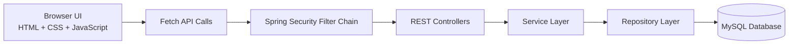

# Placify

> Smart Campus Placement Management System built with Spring Boot, MySQL, JWT security, and a professional no-framework frontend.


## Overview

Placify is a full-stack campus placement platform designed for final-year project demonstration as well as real institutional workflow modeling. It centralizes student profiles, recruiter job postings, company management, and application tracking into one secure web application.

The backend is structured using a clean layered architecture:

- `Controller → Service → Repository → Entity`
- DTO-based API contracts
- Global exception handling
- Validation annotations
- JWT authentication with role-based authorization
- MySQL persistence using JPA and Hibernate

The frontend is intentionally built with plain `HTML`, `CSS`, and `JavaScript` so the full request flow remains transparent and easy to evaluate academically. The UI follows a modern dark SaaS design with a dedicated sidebar, topbar, and responsive layout — no CSS frameworks used.

## Why This Project

Most college placement workflows still rely on spreadsheets, email threads, and messaging groups. That creates:

- Fragmented candidate data
- Repeated manual updates
- Poor visibility of active jobs
- Weak access control
- No clean application tracking

Placify solves this by giving each stakeholder a dedicated role and workflow:

- **Admin** manages the platform, companies, and oversight actions
- **Recruiter** posts jobs and reviews applications
- **Student** maintains a profile, browses jobs, applies, and tracks status

## Core Features

- Secure login and registration (separate, dedicated pages)
- JWT token generation and request validation
- BCrypt password encryption
- Role-based access control for `ADMIN`, `RECRUITER`, and `STUDENT`
- Student profile management with skill chip autocomplete on registration
- Company creation and listing
- Job posting, viewing, and filtering
- Job application and status tracking with visual pipeline
- Modern SaaS-style frontend with dark theme, sidebar navigation, and dynamic API integration
- Clean MySQL schema with optional demo seed data

## Architecture



### Role Access Model

| Role | Main Responsibilities |
| --- | --- |
| `ADMIN` | Manage companies, oversee jobs, manage platform-level operations |
| `RECRUITER` | Post jobs, manage jobs, review candidate applications |
| `STUDENT` | Update profile, browse jobs, apply, track application status |

## Tech Stack

| Layer | Technology |
| --- | --- |
| Backend | Spring Boot 4.0.3 |
| Language | Java 21 |
| Security | Spring Security, JWT, BCrypt |
| ORM | Spring Data JPA, Hibernate |
| Database | MySQL 8+ |
| Frontend | HTML, CSS, JavaScript (ES Modules) |
| Build Tool | Maven 3.9+ |
| API Testing | Postman |

## Application Modules

### 1. Authentication

- Register student and recruiter accounts (with skills chip autocomplete for students)
- Login with JWT token generation
- Fetch current authenticated user (`/api/auth/me`)
- Session stored in `localStorage`; flash messages via `sessionStorage`

### 2. Student Profile Management

- View profile with avatar initials and skill tag chips
- Update skills, resume link, and branch
- View available and eligible jobs
- Track application pipeline (Applied → In Review → Shortlisted → Selected)

### 3. Company Management

- Add company (Admin only)
- View company directory
- Company logo initials displayed in cards

### 4. Job Management

- Post and edit jobs (Recruiter / Admin)
- View and filter all jobs by title, company, eligibility, and status
- Delete job postings

### 5. Application Management

- Apply for a job with one click
- View personal applications with status pipeline visualization
- Update application status (Recruiter / Admin)

## Frontend Pages

The frontend is served directly by Spring Boot from `src/main/resources/static`.

| Route | Purpose |
| --- | --- |
| `/` | Landing page — hero, features, how it works, CTA |
| `/login.html` | Dedicated login page |
| `/register.html` | Dedicated registration page with skills chip autocomplete |
| `/jobs.html` | Public and authenticated job listings with filters |
| `/student-dashboard.html` | Student profile, stats, open roles, and application tracker |
| `/recruiter-dashboard.html` | Recruiter / admin management workspace |
| `/applications.html` | Student application tracking and recruiter status updates |

### Frontend Design System

- Dark theme — base color `#07101f`, surface `#0f1d32`, accent `#6366f1` (indigo), `#06b6d4` (cyan)
- Left sidebar with SVG-icon navigation (role-based links)
- Top navbar with notification bell and user avatar chip
- Fully responsive — sidebar collapses to hamburger on mobile
- Smooth hover lifts, transitions, and skeleton loaders
- ES Module JS — `api.js` (shared API layer), `common.js` (layout/UI helpers), page-specific JS files

## Project Structure

```text
Placify/
├── database/
│   ├── 01_reset_placify_schema.sql
│   ├── 03_seed_placify_data.sql
│   └── 04_login_credentials.md
├── src/
│   └── main/
│       ├── java/
│       │   └── com/placify/
│       │       ├── config/
│       │       │   ├── DataInitializer.java
│       │       │   ├── PasswordConfig.java
│       │       │   └── SecurityConfig.java
│       │       ├── controller/
│       │       │   ├── ApplicationController.java
│       │       │   ├── AuthController.java
│       │       │   ├── CompanyController.java
│       │       │   ├── JobController.java
│       │       │   ├── StudentController.java
│       │       │   └── UserController.java
│       │       ├── dto/
│       │       │   ├── application/
│       │       │   ├── auth/
│       │       │   ├── common/
│       │       │   ├── company/
│       │       │   ├── job/
│       │       │   ├── student/
│       │       │   └── user/
│       │       ├── entity/
│       │       │   ├── Application.java
│       │       │   ├── BaseEntity.java
│       │       │   ├── Company.java
│       │       │   ├── Job.java
│       │       │   ├── Student.java
│       │       │   └── User.java
│       │       ├── enums/
│       │       │   ├── ApplicationStatus.java
│       │       │   └── Role.java
│       │       ├── exception/
│       │       │   ├── BadRequestException.java
│       │       │   ├── GlobalExceptionHandler.java
│       │       │   └── ResourceNotFoundException.java
│       │       ├── repository/
│       │       ├── security/
│       │       │   ├── CustomUserDetailsService.java
│       │       │   ├── JwtAuthenticationFilter.java
│       │       │   ├── JwtUtil.java
│       │       │   ├── RestAccessDeniedHandler.java
│       │       │   └── RestAuthenticationEntryPoint.java
│       │       ├── service/
│       │       │   └── impl/
│       │       └── PlacifyApplication.java
│       └── resources/
│           ├── application.properties
│           └── static/
│               ├── css/
│               │   └── styles.css
│               ├── images/
│               │   └── Logo.png
│               ├── js/
│               │   ├── api.js
│               │   ├── applications-page.js
│               │   ├── common.js
│               │   ├── jobs-page.js
│               │   ├── landing-page.js
│               │   ├── login-page.js
│               │   ├── recruiter-dashboard.js
│               │   ├── register-page.js
│               │   └── student-dashboard.js
│               ├── applications.html
│               ├── favicon.svg
│               ├── index.html
│               ├── jobs.html
│               ├── login.html
│               ├── register.html
│               ├── recruiter-dashboard.html
│               └── student-dashboard.html
└── pom.xml
```

## Domain Model

| Entity | Key Fields | Relationship Summary |
| --- | --- | --- |
| `User` | `id`, `name`, `email`, `password`, `role` | One-to-one with `Student` |
| `Student` | `skills`, `resume`, `branch` | Linked to `User`, one-to-many with `Application` |
| `Company` | `name`, `industry`, `website`, `location`, `description` | One-to-many with `Job` |
| `Job` | `title`, `description`, `eligibility`, `location`, `salaryPackage` | Many-to-one with `Company`, one-to-many with `Application` |
| `Application` | `student`, `job`, `status` | Links one student to one job |

## API Summary

### Auth APIs

- `POST /api/auth/register`
- `POST /api/auth/login`
- `GET /api/auth/me`

### Student APIs

- `GET /api/students/me`
- `PUT /api/students/me`
- `GET /api/students/me/jobs/available`

### Company APIs

- `POST /api/companies`
- `GET /api/companies`
- `GET /api/companies/{companyId}`
- `PUT /api/companies/{companyId}`
- `DELETE /api/companies/{companyId}`

### Job APIs

- `POST /api/jobs`
- `GET /api/jobs`
- `GET /api/jobs/{jobId}`
- `GET /api/jobs/company/{companyId}`
- `PUT /api/jobs/{jobId}`
- `DELETE /api/jobs/{jobId}`

### Application APIs

- `POST /api/applications`
- `GET /api/applications`
- `GET /api/applications/{applicationId}`
- `GET /api/applications/my`
- `GET /api/applications/student/{studentId}`
- `GET /api/applications/job/{jobId}`
- `PATCH /api/applications/{applicationId}/status`
- `DELETE /api/applications/{applicationId}`

## Security Rules

| Endpoint Area | Allowed Role |
| --- | --- |
| Company create / update / delete | `ADMIN` |
| Job create / update / delete | `ADMIN`, `RECRUITER` |
| Apply for jobs | `STUDENT` |
| View own applications | `STUDENT` |
| View all applications / update status | `ADMIN`, `RECRUITER` |
| View applications by student / delete application | `ADMIN` |
| Static assets (`/`, `/*.html`, `/css/**`, `/js/**`, `/images/**`) | Public |

## Database Setup

### Application Configuration

Main config file: `src/main/resources/application.properties`

The project supports environment-variable-based database configuration:

```properties
spring.datasource.url=jdbc:mysql://localhost:3306/placify?createDatabaseIfNotExist=true&useSSL=false&allowPublicKeyRetrieval=true&serverTimezone=UTC
spring.datasource.username=${PLACIFY_DB_USERNAME:root}
spring.datasource.password=${PLACIFY_DB_PASSWORD:}
```

For local execution, either:

- Set environment variables `PLACIFY_DB_USERNAME` and `PLACIFY_DB_PASSWORD`
- Or update `application.properties` directly with your local MySQL credentials

The database (`placify`) is created automatically if it does not exist.

### Database Scripts

| File | Purpose |
| --- | --- |
| `database/01_reset_placify_schema.sql` | Drop and recreate the schema |
| `database/03_seed_placify_data.sql` | Insert the approved professional demo dataset |
| `database/04_login_credentials.md` | Presentation-ready login accounts |

## Quick Start

### Prerequisites

- Java 21 (Temurin recommended)
- Maven 3.9+
- MySQL 8+ running locally

### 1. Clone the Repository

```bash
git clone https://github.com/Kumar-Aditya-Singh/Placify.git
cd Placify
```

### 2. Configure MySQL

Make sure MySQL is running on `localhost:3306`.

The database is created automatically on first run. If you prefer to create it manually:

```sql
CREATE DATABASE placify CHARACTER SET utf8mb4 COLLATE utf8mb4_unicode_ci;
```

Update `application.properties` if your MySQL root password is not empty:

```properties
spring.datasource.password=your_password_here
```

### 3. Build the Project

```bash
mvn clean compile
```

### 4. Run the Application

```bash
mvn spring-boot:run
```

If port `8080` is occupied:

```bash
mvn spring-boot:run -Dspring-boot.run.arguments=--server.port=8081
```

### 5. Open in Browser

```text
http://localhost:8080
```

You will see the Placify landing page. Register a new account or use the demo credentials below.

## VS Code Run Tasks

The project includes helper PowerShell scripts and VS Code tasks:

- `run-placify.ps1` — starts the application
- `stop-placify.ps1` — stops the running process

Use via VS Code:

1. `Terminal → Run Task`
2. Choose `Run Placify`

To stop: choose `Stop Placify`, or press `Ctrl + C` in the active terminal.

## Demo Accounts

Seeded demo credentials are documented in `database/04_login_credentials.md`.

| Role | Email | Password |
| --- | --- | --- |
| Admin | `admin@placify.com` | `Admin@Placify2026` |
| Recruiter | `recruiter.microsoft@placify.com` | `Recruiter@Placify2026` |
| Student | `ananya.gupta@placify.com` | `Student@Placify2026` |

> Seed data is disabled by default. Set `PLACIFY_SEED_ENABLED=true` (or update `application.properties`) to load demo data on startup.

## Postman Collection

Collection file: `Placify.postman_collection.json`

Suggested demo order:

1. Login and capture JWT token
2. List companies
3. Create or view jobs
4. Log in as student
5. Apply for a job
6. Track application status

## Project Assets

| Asset | Path |
| --- | --- |
| Database schema reset | `database/01_reset_placify_schema.sql` |
| Seed SQL | `database/03_seed_placify_data.sql` |
| Login credentials | `database/04_login_credentials.md` |
| Postman collection | `Placify.postman_collection.json` |

## Verification Status

Verified during development:

- Project compiles successfully
- Spring Boot starts against MySQL (`placify` database)
- JWT login works for all three roles
- Protected routes enforce role restrictions
- Static assets served correctly (logo, CSS, JS)
- Landing page with hero, features, how-it-works, and CTA sections
- Separate login and register pages with skills chip autocomplete
- Student workflow: register → view jobs → apply → track pipeline
- Recruiter workflow: post job → manage listings → review applicants
- Admin workflow: manage companies → oversee jobs and applications
- Responsive layout — sidebar collapses on mobile

## Future Enhancements

- Interview scheduling and calendar integration
- Email notifications for status changes
- Resume file upload and parsing
- Analytics dashboard with placement statistics
- Pagination and advanced filtering
- AI-assisted job recommendations based on student skills
- Cloud deployment and CI/CD pipeline
- Dark / light theme toggle

## Repository Notes

This repository is intended to present the project professionally for:

- Final-year major project evaluation
- GitHub portfolio visibility
- Technical demonstration of secure full-stack development

Recommended next additions to strengthen the repo further:

- Screenshots of the landing page and dashboards in this README
- A short project demo video link
- A `LICENSE` file
- Deployment screenshots or a live demo link
