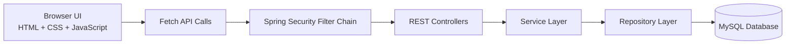

# CareerLink

> Smart Campus Placement Management System built with Spring Boot, MySQL, JWT security, and a professional no-framework frontend.


## Overview

CareerLink is a full-stack campus placement platform designed for final-year project demonstration as well as real institutional workflow modeling. It centralizes student profiles, recruiter job postings, company management, and application tracking into one secure web application.

The project is structured using a clean backend architecture:

- `Controller -> Service -> Repository -> Entity`
- DTO-based API contracts
- global exception handling
- validation annotations
- JWT authentication with role-based authorization
- MySQL persistence using JPA and Hibernate

The frontend is intentionally built with plain `HTML`, `CSS`, and `JavaScript` so the full request flow remains transparent and easy to evaluate academically.

## Why This Project

Most college placement workflows still rely on spreadsheets, email threads, and messaging groups. That creates:

- fragmented candidate data
- repeated manual updates
- poor visibility of active jobs
- weak access control
- no clean application tracking

CareerLink solves this by giving each stakeholder a dedicated role and workflow:

- **Admin** manages the platform, companies, and oversight actions
- **Recruiter** posts jobs and reviews applications
- **Student** maintains a profile, browses jobs, applies, and tracks status

## Core Features

- Secure login and registration
- JWT token generation and request validation
- BCrypt password encryption
- Role-based access control for `ADMIN`, `RECRUITER`, and `STUDENT`
- Student profile management
- Company creation and listing
- Job posting, viewing, and filtering
- Job application and status tracking
- Professional frontend with dynamic API integration
- Clean MySQL schema and professional demo seed data

## Architecture



### Role Access Model

| Role | Main Responsibilities |
| --- | --- |
| `ADMIN` | Manage companies, oversee jobs, manage platform-level operations |
| `RECRUITER` | Post jobs, manage jobs, review candidate applications |
| `STUDENT` | Update profile, browse jobs, apply, track application status |

## Tech Stack

| Layer | Technology |
| --- | --- |
| Backend | Spring Boot 4.0.3 |
| Language | Java 21 |
| Security | Spring Security, JWT, BCrypt |
| ORM | Spring Data JPA, Hibernate |
| Database | MySQL |
| Frontend | HTML, CSS, JavaScript |
| Build Tool | Maven |
| API Testing | Postman |

## Application Modules

### 1. Authentication

- Register student and recruiter accounts
- Login with JWT token generation
- Fetch current authenticated user

### 2. Student Profile Management

- View profile
- Update skills, resume, and branch
- View available jobs

### 3. Company Management

- Add company
- View company directory
- Admin-controlled operations

### 4. Job Management

- Post jobs
- View all jobs
- Filter jobs by title, company, eligibility, and active status

### 5. Application Management

- Apply for a job
- View personal applications
- Update application status

## Frontend Pages

The application frontend is served directly by Spring Boot from `src/main/resources/static`.

| Route | Purpose |
| --- | --- |
| `/` | Login and registration |
| `/jobs.html` | Public and authenticated job listings |
| `/student-dashboard.html` | Student profile and actions |
| `/recruiter-dashboard.html` | Recruiter/admin management workflow |
| `/applications.html` | Student application tracking and recruiter status updates |

## Project Structure

```text
CareerLink-Placement-Management-System/
|-- .vscode/
|   |-- settings.json
|   `-- tasks.json
|-- database/
|   |-- 01_reset_careerlink_schema.sql
|   |-- 03_seed_careerlink_data.sql
|   `-- 04_login_credentials.md
|-- docs/
|   `-- CareerLink_Project_Report.md
|-- src/
|   |-- main/
|   |   |-- java/
|   |   |   `-- com/
|   |   |       `-- careerlink/
|   |   |           |-- config/
|   |   |           |   |-- DataInitializer.java
|   |   |           |   |-- PasswordConfig.java
|   |   |           |   `-- SecurityConfig.java
|   |   |           |-- controller/
|   |   |           |   |-- ApplicationController.java
|   |   |           |   |-- AuthController.java
|   |   |           |   |-- CompanyController.java
|   |   |           |   |-- JobController.java
|   |   |           |   |-- StudentController.java
|   |   |           |   `-- UserController.java
|   |   |           |-- dto/
|   |   |           |   |-- application/
|   |   |           |   |   |-- ApplicationRequest.java
|   |   |           |   |   |-- ApplicationResponse.java
|   |   |           |   |   `-- ApplicationStatusUpdateRequest.java
|   |   |           |   |-- auth/
|   |   |           |   |   |-- AuthResponse.java
|   |   |           |   |   |-- LoginRequest.java
|   |   |           |   |   `-- RegisterRequest.java
|   |   |           |   |-- common/
|   |   |           |   |   |-- ApiResponse.java
|   |   |           |   |   `-- ErrorResponse.java
|   |   |           |   |-- company/
|   |   |           |   |   |-- CompanyRequest.java
|   |   |           |   |   `-- CompanyResponse.java
|   |   |           |   |-- job/
|   |   |           |   |   |-- JobRequest.java
|   |   |           |   |   `-- JobResponse.java
|   |   |           |   |-- student/
|   |   |           |   |   |-- StudentProfileUpdateRequest.java
|   |   |           |   |   |-- StudentRequest.java
|   |   |           |   |   `-- StudentResponse.java
|   |   |           |   `-- user/
|   |   |           |       |-- UserRequest.java
|   |   |           |       `-- UserResponse.java
|   |   |           |-- entity/
|   |   |           |   |-- Application.java
|   |   |           |   |-- BaseEntity.java
|   |   |           |   |-- Company.java
|   |   |           |   |-- Job.java
|   |   |           |   |-- Student.java
|   |   |           |   `-- User.java
|   |   |           |-- enums/
|   |   |           |   |-- ApplicationStatus.java
|   |   |           |   `-- Role.java
|   |   |           |-- exception/
|   |   |           |   |-- BadRequestException.java
|   |   |           |   |-- GlobalExceptionHandler.java
|   |   |           |   `-- ResourceNotFoundException.java
|   |   |           |-- repository/
|   |   |           |   |-- ApplicationRepository.java
|   |   |           |   |-- CompanyRepository.java
|   |   |           |   |-- JobRepository.java
|   |   |           |   |-- StudentRepository.java
|   |   |           |   `-- UserRepository.java
|   |   |           |-- security/
|   |   |           |   |-- CustomUserDetailsService.java
|   |   |           |   |-- JwtAuthenticationFilter.java
|   |   |           |   |-- JwtUtil.java
|   |   |           |   |-- RestAccessDeniedHandler.java
|   |   |           |   `-- RestAuthenticationEntryPoint.java
|   |   |           |-- service/
|   |   |           |   |-- impl/
|   |   |           |   |   |-- ApplicationServiceImpl.java
|   |   |           |   |   |-- AuthServiceImpl.java
|   |   |           |   |   |-- CompanyServiceImpl.java
|   |   |           |   |   |-- JobServiceImpl.java
|   |   |           |   |   |-- StudentServiceImpl.java
|   |   |           |   |   `-- UserServiceImpl.java
|   |   |           |   |-- ApplicationService.java
|   |   |           |   |-- AuthService.java
|   |   |           |   |-- CompanyService.java
|   |   |           |   |-- JobService.java
|   |   |           |   |-- StudentService.java
|   |   |           |   `-- UserService.java
|   |   |           `-- CareerLinkApplication.java
|   |   `-- resources/
|   |       |-- application.properties
|   |       `-- static/
|   |           |-- applications.html
|   |           |-- favicon.svg
|   |           |-- index.html
|   |           |-- jobs.html
|   |           |-- recruiter-dashboard.html
|   |           |-- student-dashboard.html
|   |           |-- css/
|   |           |   `-- styles.css
|   |           `-- js/
|   |               |-- api.js
|   |               |-- applications-page.js
|   |               |-- auth-page.js
|   |               |-- common.js
|   |               |-- jobs-page.js
|   |               |-- recruiter-dashboard.js
|   |               `-- student-dashboard.js
|   `-- test/
|       `-- java/
|           `-- com/
|               `-- careerlink/
|-- .gitignore
|-- CareerLink.postman_collection.json
|-- DATABASE_EDIT_GUIDE.txt
|-- docker-compose.yml
|-- pom.xml
|-- README.md
|-- run-careerlink.ps1
`-- stop-careerlink.ps1
```

## Domain Model

| Entity | Key Fields | Relationship Summary |
| --- | --- | --- |
| `User` | `id`, `name`, `email`, `password`, `role` | One-to-one with `Student` |
| `Student` | `skills`, `resume`, `branch` | Linked to `User`, one-to-many with `Application` |
| `Company` | `name`, `industry`, `website`, `location`, `description` | One-to-many with `Job` |
| `Job` | `title`, `description`, `eligibility`, `location`, `salaryPackage` | Many-to-one with `Company`, one-to-many with `Application` |
| `Application` | `student`, `job`, `status` | Links one student to one job |

## API Summary

### Auth APIs

- `POST /api/auth/register`
- `POST /api/auth/login`
- `GET /api/auth/me`

### Student APIs

- `GET /api/students/me`
- `PUT /api/students/me`
- `GET /api/students/me/jobs/available`

### Company APIs

- `POST /api/companies`
- `GET /api/companies`
- `GET /api/companies/{companyId}`
- `PUT /api/companies/{companyId}`
- `DELETE /api/companies/{companyId}`

### Job APIs

- `POST /api/jobs`
- `GET /api/jobs`
- `GET /api/jobs/{jobId}`
- `GET /api/jobs/company/{companyId}`
- `PUT /api/jobs/{jobId}`
- `DELETE /api/jobs/{jobId}`

### Application APIs

- `POST /api/applications`
- `GET /api/applications`
- `GET /api/applications/{applicationId}`
- `GET /api/applications/my`
- `GET /api/applications/student/{studentId}`
- `GET /api/applications/job/{jobId}`
- `PATCH /api/applications/{applicationId}/status`
- `DELETE /api/applications/{applicationId}`

## Security Rules

| Endpoint Area | Allowed Role |
| --- | --- |
| Company create/update/delete | `ADMIN` |
| Job create/update/delete | `ADMIN`, `RECRUITER` |
| Apply for jobs | `STUDENT` |
| View own applications | `STUDENT` |
| View all applications / update status | `ADMIN`, `RECRUITER` |
| View applications by student / delete application | `ADMIN` |

## Database Setup

### Application Configuration

Main config file:

- `src/main/resources/application.properties`

The project supports environment-variable-based database configuration:

```properties
spring.datasource.url=jdbc:mysql://localhost:3306/careerlink?createDatabaseIfNotExist=true&useSSL=false&allowPublicKeyRetrieval=true&serverTimezone=UTC
spring.datasource.username=${CAREERLINK_DB_USERNAME:root}
spring.datasource.password=${CAREERLINK_DB_PASSWORD:YOUR_LOCAL_PASSWORD}
```

For local execution, either:

- set `CAREERLINK_DB_USERNAME` and `CAREERLINK_DB_PASSWORD`
- or update `application.properties` with your own local MySQL credentials

### Database Scripts

| File | Purpose |
| --- | --- |
| `database/01_reset_careerlink_schema.sql` | Drop and recreate the CareerLink schema |
| `database/03_seed_careerlink_data.sql` | Insert the approved professional demo dataset |
| `database/04_login_credentials.md` | Presentation-ready login accounts |

## Quick Start

### Prerequisites

- Java 21
- Maven
- MySQL running locally

### 1. Clone the Repository

```bash
git clone https://github.com/Kumar-Aditya-Singh/CareerLink-Placement-Management-System.git
cd CareerLink-Placement-Management-System
```

### 2. Configure MySQL

Make sure MySQL is running on:

```text
localhost:3306
```

If needed, create the database manually:

```sql
CREATE DATABASE careerlink;
```

### 3. Build the Project

```bash
mvn clean compile
```

### 4. Run the Application

```bash
mvn spring-boot:run
```

If port `8080` is occupied:

```bash
mvn spring-boot:run -Dspring-boot.run.arguments=--server.port=8081
```

### 5. Open in Browser

```text
http://localhost:8080
```

## VS Code Run Tasks

This project includes helper scripts and VS Code tasks:

- `run-careerlink.ps1`
- `stop-careerlink.ps1`
- `.vscode/tasks.json`

Use:

1. `Terminal -> Run Task`
2. choose `Run CareerLink`

To stop:

1. `Terminal -> Run Task`
2. choose `Stop CareerLink`

You can also stop the app with `Ctrl + C` in the active terminal.

## Demo Accounts

The seeded demo credentials are documented in:

- `database/04_login_credentials.md`

Quick summary:

| Role | Email | Password |
| --- | --- | --- |
| Admin | `admin@careerlink.com` | `Admin@CareerLink2026` |
| Recruiter | `recruiter.microsoft@careerlink.com` | `Recruiter@CareerLink2026` |
| Student | `ananya.gupta@careerlink.com` | `Student@CareerLink2026` |

## Postman Collection

Postman collection file:

- `CareerLink.postman_collection.json`

Suggested demo order:

1. login and capture JWT token
2. list companies
3. create or view jobs
4. log in as student
5. apply for a job
6. track application status

## Project Assets

| Asset | Path |
| --- | --- |
| Final report draft | `docs/CareerLink_Project_Report.md` |
| Database edit guide | `DATABASE_EDIT_GUIDE.txt` |
| Schema reset script | `database/01_reset_careerlink_schema.sql` |
| Seed SQL | `database/03_seed_careerlink_data.sql` |
| Login credentials | `database/04_login_credentials.md` |

## Verification Status

Verified during development:

- project compile success
- successful Spring Boot startup against MySQL
- working JWT login for all three roles
- protected routes enforcing role restrictions
- frontend pages returning successful responses
- student workflow: login -> view jobs -> apply -> track application
- admin workflow: manage companies
- recruiter workflow: manage jobs and applications

## Future Enhancements

- interview scheduling
- email notifications
- resume upload and parsing
- analytics dashboard
- pagination and advanced filtering
- cloud deployment and CI/CD
- AI-assisted job recommendation

## Repository Notes

This repository is intended to present the project professionally for:

- final-year major project evaluation
- GitHub portfolio visibility
- technical demonstration of secure full-stack development

If you want to improve the repo further, the best next additions are:

- screenshots in the README
- a short project demo video link
- a LICENSE file
- deployment screenshots or architecture images
